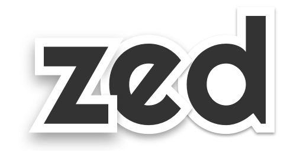

ZED stands for Z-Elevation based Drop-shadows. But really, it's  the correct way to pronounce the first letter of z-index, and the last letter of the alphabet 🇨🇦

Zed creates more realistic-looking overlapping drop-shadows. The way drop-shadows are drawn by default in CSS doesn't take other elevated elements into account. Zed fixes this by casting shadows on these other elements, creating a more realistic shadow effect.

## Installation
Install `zed-shadow` from NPM

```
npm i zed-shadow
```

## Usage
### Initialization
```js
import Zed from 'zed-shadow'

// Initialize Zed with a DOM element, or a selector string

const Z = new Zed('#shadow-container')
// or 
const Z = new Zed(document.getElementByID('#shadow-container)) 
```

Add the `zed` attribute to the DOM elements you want to elevate 
```html
<main id="shadow-container">
  <div zed="2">This div has a level 2 shadow</div>
  <div zed="4">This div has a level 4 shadow</div>
</main>
```

Include Zed styles in your main/global css file
```css
  @import url('../path/to/node_modules/zed-shadow/lib/zed.css'); 
```

### Modifying the default shadow distance
If you want to change the definition of `1 zed` unit, modify it with 
```js
let x = 2 // any number

Z.setElevationIncrement(x)
Z.update() // Need to redraw the shadows
```


### Updating shadows
To update the `zed` attribute of an element, this still needs to be done manually
```js
Z.update()
``` 
See the current `vue` example.

Live updating should be coming soon!

## Examples
See the [demo](./demo) directory to see examples in some common frameworks.

## Development

To develop Zed and test with one of the demo apps, first start watching the `src` directory:
```
npm run watch

// or

gulp
```

Then link that directory to the demo app(s) you want to use

```
npm run link:ng // coming soon
npm run link:react
npm run link:vue
```

Finally run the demo app
```
npm run start:ng //coming soon
npm run start:react
npm run start:vue
```
